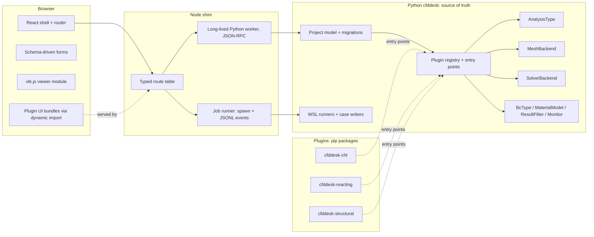

# CFD Desk Plugin Architecture Roadmap

## Detailed per-phase plans

- [Phase 0: Hygiene and Tooling](phase0_hygiene_and_tooling.plan.md)
- [Phase 1: Single Case Writer in Python](phase1_single_case_writer.plan.md)
- [Phase 2: Registries and Plugin Core](phase2_registries_and_plugin_core.plan.md)
- [Phase 3: Node Shim and Python Worker](phase3_node_shim_and_worker.plan.md)
- [Phase 4: React + TypeScript Frontend as Islands](phase4_react_islands_frontend.plan.md)
- [Phase 5: Plugin Loader End to End](phase5_plugin_loader_end_to_end.plan.md)
- [Phase 6: CHT as the First Real Plugin](phase6_cht_first_real_plugin.plan.md)

Corrections to this roadmap found during detailed research: the repo has **no `.git`** (Phase 0 starts with `git init`); `pimpleFoam` exists only in JS today, so Phase 1 must add transient support to `cfddesk` rather than "move" it; the web-format sibling JSON files (`boundary_conditions.json`, `materials.json`, `mesh.json`, ...) are the UI's real source of truth, not `project.json`, so Phase 1 needs an adapter and Phase 2 collapses them; AmgX is never installed by Setup.

## Frontend recommendation (answering your question)

**React + TypeScript, migrated incrementally as islands, with schema-driven forms.** Reasoning:

- Most plugins should ship **no UI code at all**. A CHT or reacting-flow plugin declares its settings as JSON Schema in Python; the frontend renders the form. This is what keeps plugins small and keeps third parties from having to learn your UI internals.
- For the minority that need a custom widget (a reaction-mechanism editor, a motion path picker), React is the ecosystem the largest number of outside contributors already know, has mature schema-form libraries (`@rjsf`), and works fine beside vtk.js (viewer stays imperative, mounted via a ref). Svelte/Solid are lighter but shrink your plugin-author pool.
- TypeScript gives plugin authors a typed `PluginUiApi` (`registerPanel`, `useProject`, `useJob`, `viewer.addActor`) that is discoverable from autocomplete instead of from reading `main.js`.
- Incremental: each existing `#panel-*` div in `index.html` becomes a React root one at a time. Vanilla and React coexist during the migration; nothing is rewritten in one shot. Panel chrome (Done / Delete, persist on Apply) stays identical.

## Target architecture

## Phase 0: Hygiene (no behavior change)

- Delete the duplicate tree `CFD-Desk/`; make `pack-portable.ps1` build the distributable from `git archive` instead of a checked-in copy.
- Python: add `pytest` config, move `cfddesk/cad/test_compound.py` and `cfddesk/mesh/test_web_refinements.py` into `python/tests/`, add `ruff` + `mypy` config in `python/pyproject.toml`. First new tests: `Project` migration fixtures v5 to v13, `standard_surface_size_m` in `cfddesk/mesh/standard_hexcore.py`, golden-file tests for `cfddesk/case/writer.py` (write a case, diff against stored `fvSolution` / `controlDict`).
- JS: ESLint + `tsconfig.json` with `checkJs` on `scripts/`; one Playwright smoke spec (open sample project, Generate at fineness 1, assert `n_cells > 0`). Playwright is already in `devDependencies`.
- Pin deps: `requirements.lock` for the venv; record OpenFOAM/cfMesh versions in `.cfddesk-local.json` and verify at startup in `scripts/wsl-env.js`.
- Structured JSONL logging to `.cache/logs/` keyed by job id.

## Phase 1: One case writer, in Python

- Move the inline `controlDict` / `fvSchemes` / `fvSolution` / function-object text in `scripts/w27-solve.js` (~lines 1391-1572) and `scripts/w30-transient.js` into `cfddesk/case/writer.py`. Python already writes these for the AmgX path; make it the only writer.
- Move the bash templates out of JS string literals (`GENERATE_SH_TEMPLATE` in `scripts/w21-mesh-generate.js`, solve script in `w27-solve.js`) into `cfddesk/wsl/templates/*.sh` rendered by Python.
- Standardize the job protocol: every Python tool emits JSONL `{"event":"progress"|"log"|"result", ...}`. Generalizes the existing `CFMESH_PROGRESS` / `CFMESH_RESULT` contract; retire `W25_*` log-line grepping.
- Node stops touching `project.json` directly (10 files in `scripts/` do today). All mutations go through `cfddesk` via a CLI or the worker from Phase 3.
- Golden tests from Phase 0 lock behavior across the move.

## Phase 2: Registries in Python (built-ins re-registered, no UI change)

Extend the existing `BcTypeSpec` pattern in `cfddesk/case/bc_registry.py` ("adding a type is a data change, not a new code path") to every domain concept. New package `cfddesk/registry/`:

- `AnalysisType`: key, label, category, fields (U, p, T, Y_i, D...), allowed BC/material/solver keys, settings JSON Schema, `write_case()`, `parse_log_line()`, result fields. Register `incompressible_steady` and `incompressible_transient` as built-ins; replace `PRIMARY_SIM_ANALYSIS` and the `'Incompressible'` / `'k-omega SST'` strings in `w17-simulation.js`, `w27-solve.js`, `main.js`.
- `SolverBackend`: application, parallel strategy, stop signal, residual parser. Built-ins: `simpleFoam`, `pimpleFoam`.
- `MeshBackend`: key, label, settings schema, `generate()`. Built-ins: `standard` (gmsh hexcore), `cfmesh` (frozen, per the hexcore rule), `snappy` (Hex-dominant). Replaces the three branches in `scripts/w21-mesh-generate.js`.
- `MaterialModel`, `ResultFilter` (wraps `python/tools/export_*.py`), `Monitor`.
- `Geometry` model gains multiple bodies with roles (`fluid`, `solid`) and regions. This is the prerequisite for CHT and structural; do it here rather than retrofit.
- Plugin discovery: entry point group `cfddesk.plugins` plus a local `plugins/` folder loader. Each plugin declares `requires` (e.g. `chtMultiRegionFoam`) so the runner can check WSL before offering it. Plugins may also ship `ui/` ESM bundles and JSON Schema for their panels.

## Phase 3: Node becomes a shim

- Replace the `if (parts[1] === ...)` chain in `scripts/vite-plugin-case-fields.js` with a route table; add a generic `/api/plugin/<key>/...` forward.
- Long-lived Python worker (JSON-RPC over stdio) for reads, project mutations, and OCCT preview so shapes stay in memory; spawn-per-job stays for mesh/solve.
- `GET /api/registry/*` endpoints serve labels + JSON Schema for analysis types, meshers, BC types, materials, filters.
- Serve plugin UI bundles from `/plugins/<key>/ui/*.js`.

## Phase 4: Frontend: React + TS shell with islands

- Add React, TypeScript, a schema-form library, and a small store. Keep Vite.
- `src/viewer/` wraps vtk.js as an imperative module with a typed API (`addActor`, `setColorMap`, `pick`) so both vanilla and React code call the same thing.
- Convert panels one at a time, starting where the registry changes the UI: Simulation type picker (`#panel-sim-hub`), Mesh form (`#panel-mesh-form`, engine dropdown from `/api/registry/mesh`), BC editor (`#panel-bc-editor`, form from BC schema). Each conversion deletes the matching functions from `src/main.js`.
- Finish with the home screen, results, and run control; delete `main.js` when empty.
- Publish `@cfddesk/plugin-ui` types: `registerPanel`, `registerFilter`, `useProject`, `useJob`, `viewer`.

## Phase 5: Plugin loader end to end

- Demo plugin in-repo (`plugins/example-laminar/`): registers an `AnalysisType` with no UI code, appears in the Simulation picker, writes a case, runs. Proves the seam.
- Second demo with a custom React panel to prove the UI path.
- Plugin authoring guide + template repo.

## Phase 6: First real plugin: CHT

- `cfddesk-cht`: multi-region geometry, `chtMultiRegionFoam` backend, coupled-wall BC type, thermal material model, `T` result field. Exercises regions, materials, and a new solver together; gaps found here feed back into the registry API before it is declared stable.
- Then reacting flow, radiation, motion, structural (structural needs a non-OpenFOAM `SolverBackend`, e.g. CalculiX, which the registry supports but the WSL installer must learn).

## Constraints carried through every phase

- cfMesh path stays callable and `python/HEXCORE-PROCESS-BACKUP-2026-09-02/` is untouched.
- Panel chrome rule: Done / Delete only, settings persist on Apply / Generate / field change.
- Each phase ends with the Playwright smoke and pytest green; no phase requires the next to ship.