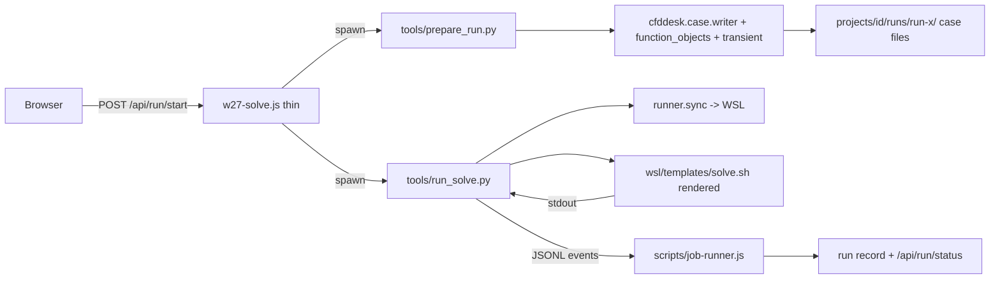

# Phase 1: Single Case Writer in Python

## Goal

After this phase there is exactly one implementation of "turn a project into an OpenFOAM case" and exactly one implementation of "run a pipeline in WSL and report progress", both in `cfddesk`. Node only spawns Python and relays events.

## Findings this phase is built on

### The JS writer that must be ported (`cfd-web/scripts/w27-solve.js`)

| What | Lines | Notes |
|---|---|---|
| `foamHeader`, `writeFoamDict`, `writeVolField` | 667-706 | header + generic field writer |
| `kOmegaFromScales` | 799-806 | k/omega inlet from speed, intensity |
| `writeSolveCase` | 1156-1618 | the whole case |
| patch BC blocks | 1234-1321 | `flowRateInletVelocity` (mass/volumetric, `rhoInlet`, `nFaces` split), `fixedValue`, `surfaceNormalFixedValue`, `pressureInletOutletVelocity`, `inletOutlet`, `slip`/`noSlip` |
| `0/U 0/p 0/k 0/omega 0/nut` | 1323-1357 | |
| `transportProperties` (nu) | 1359-1365 | |
| `turbulenceProperties` (RAS kOmegaSST fixed) | 1366-1377 | |
| function objects `mon_<patch>` (areaAverage U p), `flow_<patch>` (sum phi) | 1379-1430 | write control differs steady vs transient (`runTime`, `write_interval/50`) |
| steady `controlDict`, `fvSchemes`, `fvSolution` | 1437-1537 | `simpleFoam`, `residualControl 1e-4` |
| `fvOptions` `limitU` | 1543-1554 | `max(50, 10*speedForK)` |
| `decomposeParDict` | 1556-1564 | scotch |
| `w27-case.json` sidecar | 1567-1616 | consumed by `tools/case_units.py` (pressure units, rho) |
| `buildSolveScript` | 2011-2153 | bash: copy to WSL, decomposePar, mpirun `$APP -parallel`, live `reconstructPar -time`, copy back time dirs, markers |
| `applyProgressLine` | 87-134 | regexes for `W27_*`, `Time =`, residuals, Courant |
| `startSolve` spawn | 2258-2264 | `wsl -d <distro> -- bash solve-*.sh` |
| `stopSolve` sed `stopAt writeNow` | 2422-2433 | |
| `killSolveNow` pkill | 2462-2473 | |

`cfd-web/scripts/w30-transient.js`: `transientControlDict` 246-272 (`pimpleFoam`, `adjustTimeStep`, `maxCo`, `maxDeltaT`), `transientFvSchemes` 274-298 (`Euler`/`backward`), `transientFvSolution` 300-369 (PIMPLE `nOuterCorrectors`, `nCorrectors`, `nNonOrthogonalCorrectors`), `transientProgressFromLine` 372-389, `resolveTransientControl`, `estimateDeltaT`, `flowThroughTime`.

### The Python writer that exists (`cfd-web/python/cfddesk/case/`)

- `writer.py` `write_simplefoam_case(case_dir, *, amgx_json, default_backend="amgx", ..., project, solid) -> dict` L1050. Writes `transportProperties`, `turbulenceProperties`, `0/U 0/p (0/T)`, RAS fields via `ras.write_ras_fields`, `fvSchemes` from `NumericsSettings`, `fvSolution.cpu`/`.amgx`, `decomposeParDict`, `controlDict`, run scripts. Steady only (`SolverSettings.mode="steady"`; `numerics.py` hard-codes `steadyState`).
- `bc_registry.py`: 22 `BcTypeSpec` entries with `write_U/write_p/write_T` callbacks and `SettingField` schemas. The JS writer's BC set (velocity inlet fixed/mean/volumetric/mass, velocity outlet, pressure inlet/outlet gauge/total/mean, wall noslip/slip) maps onto existing keys.
- `ras.py`: `_ras_boundary_blocks` per semantic class; `write_ras_fields(case_dir, model, *, U_ref, intensity_pct, ...)`.
- `surface_averages.py`: `control_dict_surface_p_block(inlet, outlet)` — a **different** monitor scheme (`pInlet`/`pOutlet`) than the JS `mon_`/`flow_` scheme that the UI graphs consume. Must not silently swap; keep `mon_`/`flow_` names because `getRunMonitors` (`w27-solve.js` L998-1090) and `main.js` graphs read them.
- **`pimpleFoam` does not appear anywhere in Python.** Transient is JS-only today.
- `wsl/openfoam.py` `run_wsl_bash` uses `subprocess.run(capture_output=True)` — no streaming. `wsl/mesh_run.py` writes `run_*.sh` scripts as string literals and uses `MESH_SCRIPT_OK` / `MESH_SCRIPT_FAIL: step` markers.
- `runner/parallel.py` has `mpirun_simplefoam_inner`, `kill_mpirun_tree`, `run_potential_foam` fragments.
- `runner/sync.py` `sync_to_wsl`, `sync_solve_dicts_to_wsl`, `copy_back` with `RESULTS_MARKER`.

### Where the data the JS writer reads actually lives

`writeSolveCase` reads web-format JSON, not `Project`: `boundary_conditions.json` (`boundary_conditions[]` with `bc_type`, `faces`, `value`, `unit`, `velocity_type`, `flow_rate_type`, `direction`, `vector`, `wall_type`; `defaults.wall_type`), `materials.json` (`materials[]` `kinematic_viscosity`, `density`, `assigned_volumes`), `mesh.json`, `area_average.json` / `result_controls.json`, `simulation_control.json` (`endTime`, `writeInterval`, `transient`), `runs/catalog.json`, `geometry/cad_preview.json` (face areas/normals; regenerated with `export_step_cad_preview.py --faces-only`). `Project.from_dict` reads `project.json`, a different, versioned schema. The web JSON files are stamped copies written by `w18/w19/w20/w22/w26` and the catalog. **Both representations coexist**; Phase 1 needs an adapter, Phase 2 collapses them.

### Snappy Hex-dominant path

`w21-mesh-generate.js` `GENERATE_SH_TEMPLATE` L44 is a ~300-line bash string with embedded Python heredocs; placeholders `__WSL_TEMPLATE__`, `__BLOCK__`, `__FEATURE_LEVEL__`, `__WALLS_LEVEL__`, `__ADD_LAYERS__`, `__SNAP_*__`, etc.; markers `W25_GENERATE_START/END`, `W25_SURFACEFEATURE_END`, `W25_BLOCKMESH_END`, `W25_SNAPPY_END`, `W25_COUNTS`, `W25_FEATURE_MARKS`. `finenessParams` L~174-270 lifts `snappy_policy.py` constants into JS (duplicate of `cfddesk/mesh/snappy_policy.py`). Python already has `wsl/mesh_run.py` `run_snappy_pipeline` and `mesh/case_writer.py` `prepare_mesh_case` / `write_snappy_hex_mesh_dict` covering the same job.

### Node writes to project JSON (to be removed)

`writeProject` call sites: `w16-project-geometry.js` L102, `w17-simulation.js` ~L62/120-131, `w18-materials.js` L71, `w19-boundary-conditions.js` L134, `w20-mesh.js` L111, `w22-area-average.js` L81, `w26-mesh-refinements.js` L77, `w27-solve.js` L1994-2006 (`run_1`), `w21-mesh-generate.js` `persistMeshResult` L454+, `vite-plugin-case-fields.js`. Plus sibling files `simulation.json`, `simulations.json`, `materials.json`, `boundary_conditions.json`, `mesh.json`, `mesh_refinements.json`, `result_controls.json`, `area_average.json`, `simulation_control.json`, `runs/catalog.json`, `runs/run-*.json`, `media/*/index.json`.

## Design



## Step 1: Transient support in `cfddesk/case`

1. `cfddesk/project/settings.py`: `SolverSettings.mode: Literal["steady","transient"]` already exists as `"steady"` default. Add `cfddesk/project/transient.py`:
   ```python
   @dataclass(frozen=True)
   class TransientControl:
       end_time: float; delta_t: float; write_interval: float
       adjust_time_step: bool; max_co: float; max_delta_t: float
       time_scheme: Literal["Euler","backward"]
       n_outer_correctors: int; n_correctors: int; n_non_orthogonal_correctors: int
       @classmethod
       def from_web(cls, d: dict) -> "TransientControl"   # mirrors w30 normalizeTransient/resolveTransientControl
   def estimate_delta_t(...); def flow_through_time(...)   # port from w30 L~100-240
   ```
2. `cfddesk/case/writer.py`:
   - `write_control_dict(...)` gains `application: str`, `transient: TransientControl | None`, `functions_text: str`. Transient branch reproduces `w30.transientControlDict` exactly (`adjustableRunTime`, `adjustTimeStep`, `maxCo`, `maxDeltaT`, `runTimeModifiable`).
   - `write_fv_schemes(...)` gains `transient` param: `ddtSchemes default Euler|backward`, div schemes per `w30.transientFvSchemes` L274-298.
   - New `write_fv_solution_pimple(path, *, ctrl: TransientControl, turbulence, numerics)` porting `w30.transientFvSolution` L300-369 (PIMPLE block, relaxation only if `nOuter>1`, `pFinal`/`UFinal`).
   - `write_fv_options_limit_u(path, *, max_u: float)` porting `w27` L1543-1554.
3. Keep `numerics.py` behavior for steady untouched (golden tests from Phase 0 guard it).

## Step 2: Function objects module

`cfddesk/case/function_objects.py`:

```python
@dataclass(frozen=True)
class MonitorSpec: patch: str; kind: Literal["area_average","flow"]
def monitor_patches(project_or_runspec) -> list[str]        # inlets, pressure BCs, velocity outlets, AA faces owners (w27 L1383-1390)
def surface_field_value_block(name, patch, *, operation, fields, write_control_text, log: bool) -> str
def monitors_functions_text(patches: list[str], *, transient: TransientControl | None) -> str
     # emits mon_<patch> (areaAverage U p, log true) and flow_<patch> (sum phi, log false), write control per w27 L1397-1401
```

Existing `surface_averages.py` `pInlet/pOutlet` stays for the legacy CLI path; mark deprecated.

## Step 3: Web-JSON adapter

`cfddesk/project/web_adapter.py` — the bridge between the web-format JSON that `w18/w19/w20/w22/w27` write and the objects the writer needs. This is throwaway for Phase 2 but necessary to delete the JS writer without first rewriting the UI persistence:

```python
@dataclass
class RunSpec:
    project_dir: Path; run_id: str; mesh_case_dir: Path; n_procs: int
    solver_app: Literal["simpleFoam","pimpleFoam"]
    end_time: float; write_interval: float; transient: TransientControl | None
    nu: float; rho: float; wall_default: str
    bcs: list[WebBc]            # bc_type, faces, value, unit, velocity_type, flow_rate_type, direction, vector, wall_type, patch
    monitor_patches: list[str]
    face_props: dict[str, FaceProps]   # from cad_preview.json: area_m2, normal
def load_run_spec(project_dir, *, run_id, mesh_id, ...) -> RunSpec   # port validateSolveReady L865-922, airFromMaterials L373-388, loadFaceProps L390-408, resolveProjectMesh
def web_bc_to_registry(bc: WebBc) -> tuple[str, dict]   # bc_type+velocity_type -> bc_registry key + settings (Pa, m/s, kg/s already SI per unit field)
```

Unit handling: `w27` converts using `unit` field (m/s, ft/s, m3/s, ft3/min, kg/s, lb/s, Pa/psi/...). Reuse `cfddesk/units/convert.py` `to_si`; add missing units to `quantities.py` `UNITS` (`ft3/min`, `lb/s`) if absent.

## Step 4: `tools/prepare_run.py`

CLI: `--project-dir --run-id --mesh-id --n-procs --out-dir [--transient-json path]`. Steps:

1. `spec = load_run_spec(...)`.
2. Copy `constant/polyMesh` from `spec.mesh_case_dir` into `out_dir` (as `writeSolveCase` does).
3. Write `0/U 0/p` via `bc_registry` writers (velocity inlet variants, pressure, walls) with `ctx={"inward_normal", "n_faces", "rho"}` so `flowRateInletVelocity` per-face split matches JS L1234-1321.
4. `ras.write_ras_fields(out_dir, "kOmegaSST", U_ref=spec.speed_for_k, intensity_pct=5)` — verify against `kOmegaFromScales` L799-806; if formulas differ, add a `scales_fn` override so the golden matches, then reconcile in Phase 2.
5. `write_transport_properties(nu)`, `write_turbulence_properties("kOmegaSST")`.
6. `functions_text = monitors_functions_text(...)`; `write_control_dict(application=spec.solver_app, ..., functions_text=...)`; `write_fv_schemes(...)`; `write_fv_solution_cpu` (steady) or `write_fv_solution_pimple` (transient); `write_fv_options_limit_u`; `write_decompose_par_dict` if `n_procs>1`; `write_foam_marker`.
7. Write `w27-case.json` sidecar with the same keys (`rho`, `nu`, `bcs`, `pressure_unit`...) because `tools/case_units.py` reads it; rename later.
8. Print one JSON line `{"ok":true,"case_dir":...,"solver":...,"n_procs":...}`.

Golden test: `tests/unit/test_prepare_run_golden.py` runs `prepare_run` against `tests/fixtures/js-project/` and diffs `0/ constant/ system/` against `fixtures/golden/js_steady/` and `js_transient/` (normalized: strip `//` comment lines, collapse whitespace, ignore key order inside `functions {}` by sorting FO blocks). Fix Python until identical.

## Step 5: Solve pipeline in Python

1. `cfddesk/wsl/templates/solve.sh` — the bash from `buildSolveScript` L2011-2153, with `{{DST}} {{WIN_OUT}} {{NPROCS}} {{APP}} {{RUN_ID}}` placeholders rendered by `string.Template`-style substitution (`$$` escaping already handled by `openfoam.escape_wsl_bash_dollars`). Every `echo W27_*` becomes `echo 'CFDDESK_EVENT {"event":"stage","stage":"decompose"}'` etc. Keep OpenFOAM stdout untouched on other lines.
2. `cfddesk/wsl/templates/README.md`: placeholder contract.
3. `cfddesk/wsl/solve_run.py`: `start_solve(case_dir, *, wsl_case_id, n_procs, app) -> subprocess.Popen` using `wsl -d <distro> -- bash <script>` with `stdout=PIPE`, line-buffered; generator `iter_events(proc)` that yields `Event` objects parsed by `cfddesk/jobs/events.py` (below) and passes through solver lines as `{"event":"log","line":...}` with the residual/Courant regexes from `applyProgressLine` L87-134 and `transientProgressFromLine` L372-389 producing `{"event":"residual","time":..,"fields":{...}}` and `{"event":"courant","mean":..,"max":..,"delta_t":..}`.
4. `stop_solve(wsl_case_id, *, graceful=True)`: `sed stopAt writeNow` (port L2422-2433); `kill_solve(wsl_case_id, run_id)`: reuse `runner/parallel.kill_mpirun_tree` extended with the `cfddesk-w27-<runId>` pattern.
5. `tools/run_solve.py --case-dir --wsl-case --n-procs --app --run-id`: prepares, syncs (`runner.sync.sync_to_wsl`), streams events to stdout as JSONL, exits with the solver exit code. `tools/stop_solve.py --wsl-case --run-id [--force]`.

## Step 6: Snappy Hex-dominant script

1. Extract `GENERATE_SH_TEMPLATE` into `cfddesk/wsl/templates/snappy_hexdominant.sh`. The embedded `python3 - <<'PY'` heredocs (Body1 STL scaling, `snappyHexMeshDict` patching, eMesh validation, counts) move into `cfddesk/mesh/snappy_hexdominant.py` functions executed **on the host** before sync (they only need file I/O): `scale_body1_stl`, `write_hexdominant_dicts(case_dir, *, block, feature_level, walls_level, add_layers, snap)`, `read_polymesh_counts(case_dir)`. This removes Python-inside-bash-inside-JS-string.
2. `finenessParams` (w21 L~174-270) is deleted; use `cfddesk/mesh/snappy_policy.py` (`feature_level_from_fineness`, `snap_controls_for_fineness`, `snappy_geometry_fingerprint_payload`).
3. `tools/generate_snappy.py --project-dir --case-dir --wsl-case --generate-id --fineness --add-layers` emitting the same JSONL events as `generate_standard.py` (adapted in Step 7).
4. `w21-mesh-generate.js` Hex-dominant branch (L~1062-1352) shrinks to: spawn `generate_snappy.py`, relay events.

## Step 7: One job protocol

`cfddesk/jobs/events.py`:

```python
EVENT_PREFIX = "CFDDESK_EVENT "
@dataclass class Event: event: Literal["start","stage","progress","log","residual","courant","time_saved","counts","result","error"]; ...
def emit(event: str, **fields) -> None      # print(EVENT_PREFIX + json.dumps(...), flush=True)
def parse_line(line: str) -> Event | None
```

- `generate_standard.py` / `generate_cfmesh_standard.py`: `_progress`/`_result` now call `emit("progress"...)` / `emit("result"...)`. Keep emitting the legacy `CFMESH_PROGRESS`/`CFMESH_RESULT` lines for one phase behind `--legacy-markers` so the frontend chip mapping (`main.js` L11757-11774, stage names `gmsh`, `gmshToFoam`, `hexcore`) keeps working until Phase 4; or better, keep the **stage names** identical inside the new `progress` event so no frontend change is needed.
- `scripts/job-runner.js` (new): `spawnJob({kind, jobId, script, args, onEvent, onExit})` — spawns `PYTHON`, splits stdout by line, `parse_line`, writes JSONL log via `log.js`, calls `onEvent`. `w21` and `w27` both use it; `parseCfmeshLine` (w21 L601-617) and `applyProgressLine` (w27 L87-134) are deleted.
- Run record fields (`stage`, `iteration`, `sim_time`, `residuals`, `saved_times`, `co_max`, `delta_t`) are populated from events, so `/api/run/status` payload stays byte-compatible with what `main.js` `pollSimRunStatus` L22804 expects. Confirm with the Playwright solve smoke.

## Step 8: Delete the JS writer

From `w27-solve.js` remove: `foamHeader`, `writeFoamDict`, `writeVolField`, `kOmegaFromScales`, `writeSolveCase`, `buildSolveScript`, `applyProgressLine` and helpers, the `sed`/`pkill` spawns. Keep: HTTP handler, run catalog CRUD, `getRunMonitors` (reads `postProcessing`; move its `.dat` parsing to `cfddesk/case/surface_averages.parse_surface_field_value_dat` later in Phase 3), `validateSolveReady` (now calls `prepare_run.py --validate-only` and relays its JSON errors). From `w30-transient.js` remove the three `transient*` writers and `transientProgressFromLine`; keep label helpers used by the HTTP layer until Phase 4.

Expected size: `w27-solve.js` 2752 -> ~1200 lines.

## Step 9: Node stops writing project JSON

Introduce `tools/project_cli.py` with subcommands that wrap the existing web-JSON persistence semantics so behavior is unchanged but the writes happen in Python:

```
project_cli.py set-materials --project-dir --sim-id --json-stdin
project_cli.py set-bcs ... | set-mesh-settings ... | set-refinements ... | set-result-controls ...
project_cli.py set-sim-control ... | run-upsert ... | run-delete ... | mesh-result ...
```

Each subcommand reads the current files, applies the same merge the JS did (copy the logic: stamps `increment`, `updated_at`, `persistence`, `simulation_id`), writes atomically, and prints the resulting document. Node handlers become `const doc = await pyJson("project_cli.py", ["set-bcs", ...], body)`. Because the JS persistence functions are small and table-like, port them one file at a time: `w18` -> `w19` -> `w20` -> `w26` -> `w22` -> `w27` catalog -> `w21 persistMeshResult` -> `w17` -> `w16`. `w16` (projects list, folders, geometry import) is the largest; it may stay in Node until Phase 3's worker if time is short, but must not write `project.json` keys other than `geometry*` after this phase.

Add a lint guard: an ESLint `no-restricted-syntax` rule (or a unit test) that fails if `writeFileSync(` appears in `scripts/` with a path containing `projects/` outside `job-runner.js`/`w28-media.js`.

## Step 10: Verification

- Golden equivalence tests green (`js_steady`, `js_transient`).
- Phase 0 Playwright smoke extended: after Generate, create run, `POST /api/run/start` with `endTime=20`, poll `/api/run/status` to `done`, assert `residuals.length > 0` and `saved_times` non-empty.
- Manual: transient run on the sample transient project reaches `done` and the Graphs panel shows monitors (confirms `mon_`/`flow_` names preserved).
- `grep -r "W27_\|W25_\|CFMESH_PROGRESS" scripts/ src/` returns only the legacy-marker compatibility shim.

## Acceptance criteria

- No OpenFOAM dictionary text in any `.js` file (`grep -l "FoamFile" scripts/` empty).
- No bash heredoc in any `.js` file.
- `cfddesk/wsl/templates/` holds `solve.sh`, `snappy_hexdominant.sh`, and the four existing `run_*.sh` bodies moved out of `mesh_run.py` string literals.
- Steady and transient runs from the UI produce identical dictionaries to Phase 0 goldens.
- Only `job-runner.js` and `w28-media.js` write under `projects/`.

## Risks

- `kOmegaFromScales` (JS) vs `ras.inlet_turbulence_scalars` (Python, mixing-length with `D_h=0.0508`) likely differ. Decide: keep JS formula for equivalence now, unify in Phase 2 with a fingerprint bump. Do not silently change inlet turbulence.
- `case_units.py` depends on `w27-case.json`; keep the filename until Phase 3 renames sidecars.
- Windows path -> WSL path (`winToWsl` in JS vs `mesh_run.windows_to_wsl_path`) must agree on drive-letter case.
